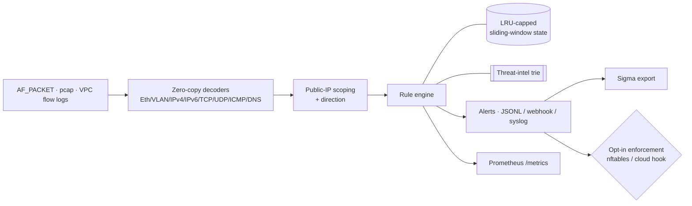

<div align="center">

# 🛡️ ingressd

**Passive, host-based intrusion detection for Linux cloud VMs.**

Watch traffic to and from your instance's public IP, detect scans, brute force,
floods, tunneling, C2 beaconing and known-bad peers, and stream structured,
MITRE-mapped alerts to your SIEM — with optional, guarded active response.

[](https://github.com/kalidada18/ingressd/actions/workflows/ci.yml)


*Defensive by design · passive by default · single static binary*

</div>

---

## What it's for

| You want to… | ingressd gives you… |
|---|---|
| **See who's attacking a public VM** | Passive capture on the internet-facing NIC; every scan, brute-force and flood is detected and alerted in real time. |
| **Feed a SIEM** | JSON-Lines alerts with MITRE technique **and** tactic, a 0–100 risk score, tags and sensor id — plus a generated **Sigma** rule pack. |
| **Detect covert channels** | DNS/ICMP tunneling and periodic **C2 beaconing** via entropy, jitter and volume analysis. |
| **Blocklist known-bad IPs** | HTTPS/local threat-intel feeds (Spamhaus, abuse.ch, ET) in a longest-prefix trie, refreshed and cached. |
| **Use your existing rules** | Load **community Snort3 `.rules`** or write declarative **TOML signatures** — no recompile. |
| **Respond automatically (carefully)** | Opt-in `nftables` / cloud-hook blocking, **dry-run by default**, with never-block guardrails. |
| **Run it like a service** | Hardened `systemd` unit (non-root, `CAP_NET_RAW` only), Docker, and a Kubernetes DaemonSet. |

---

## Architecture



**Pipeline:** capture → decode → scope to public peers → 14 stateful rules →
enrich (risk score, MITRE, GeoIP) → alert + metrics → optional block. The decode
→ engine path is safe (`#![forbid(unsafe_code)]`); the only `unsafe` is the
isolated Linux `AF_PACKET` module, behind a feature flag.

---

## Detection rules

Every rule has a configurable `threshold` / `window_s` / `cooldown_s` / `severity`,
keeps bounded per-peer state, and maps to a MITRE ATT&CK technique.

| Rule | Detects | ATT&CK | Default |
|---|---|---|---|
| `port-scan` | N distinct SYN targets from one peer (horizontal / vertical) | T1046 | medium |
| `invalid-tcp-flags` | NULL, XMAS, FIN-only, SYN+FIN, SYN+RST | T1046 | medium |
| `brute-force` | repeated new conns to SSH/RDP/SMB/FTP/Telnet/VNC/WinRM/DB | T1110 | high |
| `syn-flood` | SYN rate to a local endpoint, low completion ratio | T1498.001 | high |
| `udp-flood` / `icmp-flood` | per-target packet rate | T1498 | high |
| `reflection-amplification` | unsolicited large UDP from reflector ports (53/123/161/389/1900/11211) | T1498.002 | high |
| `dns-tunnel` | high-entropy / long / many-subdomain QNAMEs, TXT/NULL volume | T1071.004 | medium |
| `icmp-tunnel` | oversized / high-rate echo payloads | T1095 | medium |
| `beaconing` | outbound conns at near-constant intervals (low jitter) | T1071 | high |
| `threat-intel-hit` | peer in a loaded blocklist | T1071 | high |
| `suspicious-port` | traffic on known backdoor / C2 ports | T1571 | low |
| `new-listener-probe` | many sources probing a port with no listener | T1595 | low |
| `custom-signature` | your Snort3 rules + declarative TOML signatures | per-rule | per-rule |

State is capped (`max_tracked_keys`, default 200k) with LRU eviction, so a
spoofed-source flood cannot exhaust memory.

---

## Quick start

```bash
# 1. Try it offline — no privileges, no network, no libpcap
cargo run --release -- pcapgen sample.pcap
cargo run --release -- --pcap sample.pcap            # alerts stream to stdout

# 2. Install as a hardened service (Linux VM)
sudo apt-get install -y libcap2-bin
sudo ./deploy/install.sh                              # non-root user + CAP_NET_RAW

# 3. Watch it work
journalctl -u ingressd -f
curl -s http://127.0.0.1:9102/metrics
```

Production binary with live capture:

```bash
cargo build --release --features live-capture          # + geoip for ASN/country
```

<details>
<summary><b>Run with Docker or Kubernetes</b></summary>

```bash
# Docker (host networking + CAP_NET_RAW)
docker build -f deploy/Dockerfile -t ingressd .
docker compose -f deploy/docker-compose.yml up -d

# Kubernetes (DaemonSet, hostNetwork, seccomp, NET_RAW-only)
kubectl apply -f deploy/k8s/
```

</details>

---

## A sample alert

Each alert is one JSON line — ready for Splunk, Elastic (ECS), Loki, or syslog.

<details>
<summary><b>Show JSON</b></summary>

```json
{
  "id": "00000012-1a2b3c4d",
  "time": "2026-10-04T12:00:00.000000000Z",
  "rule": "brute-force",
  "severity": "high",
  "risk_score": 78,
  "direction": "inbound",
  "peer_ip": "203.0.113.7",
  "peer_asn": 64512,
  "peer_country": "US",
  "local_ip": "5.7.9.11",
  "proto": "tcp",
  "ports": { "src": 51234, "dst": 22 },
  "detail": "brute force: 24 new connections to auth ports [22] in 60s",
  "mitre": "T1110",
  "tactic": "TA0006",
  "tactic_name": "Credential Access",
  "tags": ["credential-access", "brute-force"],
  "count": 24,
  "window_s": 60,
  "sensor": "web-01",
  "schema_version": 1
}
```

</details>

---

## Extending detection

**Snort3 rules** — enforce your own or the community set, and export to Sigma:

```toml
[custom_signatures]
enabled = true
files   = ["/etc/ingressd/snort3-community.rules"]
vars    = { HOME_NET = "0.0.0.0/0", EXTERNAL_NET = "any" }
```
```bash
ingressd snort2sigma rules/snort3-community.rules > snort.yml   # → pySigma → SIEM
```

**Declarative signatures** — match protocol / direction / ports / peer-CIDR /
payload `content` (with `nocase` / `depth` / `offset`):

```toml
[[rules.signature]]
name      = "rdp-from-internet"
protocol  = "tcp"
direction = "in"
ports     = [3389]
severity  = "high"
```

**Threat-intel feeds** — any HTTPS or local file of IPs/CIDRs; validated, cached
per-feed, last-good kept on failure:

```toml
[[intel.feeds]]
name = "spamhaus-drop"
url  = "https://www.spamhaus.org/drop/drop.txt"
```

Full annotated reference: [`config.example.toml`](config.example.toml).

---

## Outputs & observability

- **Alerts** — JSON-Lines to stdout and a size-rotated file; optional syslog and
  a webhook (retry + backoff, ECS field mapping).
- **Metrics** — Prometheus on `127.0.0.1:9102`: packets, bytes, parse errors,
  drops, skipped non-public peers, alerts by rule, tracked keys, channel depth,
  LRU evictions, feed age, custom-signature count.
- **Health** — `/healthz` (liveness) and `/readyz` (readiness) for orchestrators.
- **SIEM** — `ingressd sigma` emits the full rule pack as Sigma YAML.

---

## Security posture

- **Passive by default** — observe, alert, export. Blocking is opt-in and
  **dry-run by default**.
- **Least privilege** — non-root `ingressd` user, `CAP_NET_RAW` only
  (`CAP_NET_ADMIN` only when enforcing), hardened `systemd` unit, optional
  seccomp/AppArmor confinement.
- **Never-block guardrails** — allowlisted peers, host addresses, cloud metadata,
  in-use DNS resolvers and the current SSH peer are never blocked; every action
  is logged and reversible via `ingressd unblock <ip>`.
- **Memory safety** — `#![forbid(unsafe_code)]` everywhere except the isolated
  capture module; total, bounds-checked parsers with no panics on malformed input.
- **Privacy** — public-IP-only analysis; optional `redact_local_ip` and
  time-based log retention.

> Only deploy on infrastructure you own or are authorized to monitor. `ingressd`
> never injects packets, scans third parties, or treats feed content as code.

---

## Project layout

| Crate | Responsibility |
|---|---|
| [`ingressd-core`](crates/ingressd-core) | Decoders, public-IP scoping, LRU window state, 14 rules, engine, config, metrics, Sigma, Snort parser. |
| [`ingressd-intel`](crates/ingressd-intel) | Longest-prefix blocklist trie, feed loading + caching, optional GeoIP/ASN. |
| [`ingressd-capture`](crates/ingressd-capture) | AF_PACKET (Linux), pcap replay, VPC flow-log input, bounded channel. |
| [`ingressd-cli`](crates/ingressd-cli) | The `ingressd` binary: config, sinks, metrics, reload, enforcement. |

## Documentation

Detailed guides live in [`docs/`](docs):

- [Architecture](docs/architecture.md) — data flow, threading, memory bounds, feature flags
- [Configuration](docs/configuration.md) — every `config.toml` section and key
- [Detection rules](docs/rules.md) — per-rule logic and tuning
- [Snort integration](docs/snort-integration.md) — loading & enforcing `.rules`
- [Sigma & SIEM](docs/sigma-integration.md) — Splunk / Elastic / Loki
- [Deployment](docs/deployment.md) — systemd, Docker, Kubernetes, cloud notes

Contributing guidelines are in [CONTRIBUTING.md](CONTRIBUTING.md); report
vulnerabilities per [SECURITY.md](SECURITY.md); release history lives in
[CHANGELOG.md](CHANGELOG.md).

## Repository layout

```text
Cargo.toml            workspace root
config.example.toml   fully commented reference config
crates/               ingressd-core · -intel · -capture · -cli
docs/                 architecture, configuration, rules, snort, sigma, deployment
deploy/
  ├ Dockerfile · docker-compose.yml · install.sh
  ├ systemd/        hardened service unit
  ├ k8s/            DaemonSet, ConfigMap, Service, ServiceMonitor
  ├ security/       apparmor/ + seccomp/ profiles
  └ observability/  OpenTelemetry collector config
rules/              Snort .rules (community + local examples)
sigma/              Sigma export guide
scripts/            stress + fail-open/closed validation
fuzz/               cargo-fuzz targets (own workspace)
.github/            CI workflow, issue/PR templates, dependabot
```

---

## License

Licensed under either of [MIT](LICENSE) or Apache-2.0, at your option.
