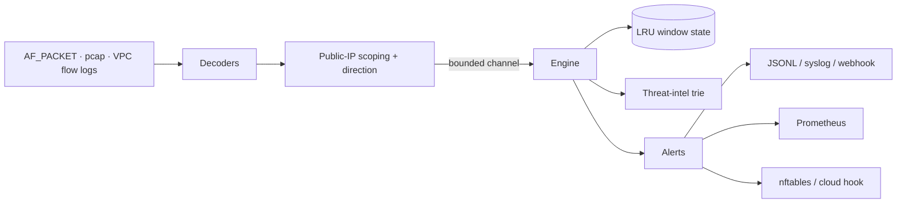

# Architecture

## Data flow

1. **Capture** (`ingressd-capture`) reads link-layer frames from one of three
   inputs — live `AF_PACKET`, an offline `.pcap`, or VPC flow logs — on a
   dedicated OS thread.
2. **Decode + scope** turns each frame into an owned `PacketEvent`: bounds-checked
   decoders parse Ethernet/VLAN/IPv4/IPv6/TCP/UDP/ICMP/DNS, then direction is
   derived from the host's own addresses and non-public peers are skipped (and
   counted).
3. **Hand-off** is a **bounded** `tokio::sync::mpsc` channel; on overflow the
   capture path sheds load (`drop`), applies backpressure (`stall`), or stops
   (`exit`) per `general.on_queue_full`.
4. **Engine** runs every enabled `Detector` over the event. Each detector owns
   its own LRU-capped sliding-window state and applies a per-(rule,peer)
   cooldown, so the engine stays rule-agnostic.
5. **Enrich + emit** — the engine adds GeoIP/ASN, computes the 0–100 risk score
   and MITRE tactic/tags, stamps the sensor id, records metrics, and fans alerts
   out to sinks. Alerts above the enforcement threshold can trigger a guarded
   block.

## Threading & memory model

- Capture/decode run on dedicated threads; the async runtime (tokio) owns the
  consumer loop, metrics server, feed refresh, and webhook worker.
- **No unbounded queues.** Channel capacity is fixed (`general.channel_capacity`).
- **No unbounded state.** Each rule's key map is capped at
  `rules.max_tracked_keys` (default 200k) with LRU eviction; evictions are
  counted (`ingressd_evictions_total`). A spoofed-source flood cannot exhaust
  memory.
- Payload is snapshotted per event up to `MAX_PAYLOAD_SNAP` (512 B) so Snort
  `content` rules can match; this bounds channel memory regardless of MTU.

## Safety

- `#![forbid(unsafe_code)]` in `ingressd-core`, `-intel`, `-cli`. The only
  `unsafe` is the Linux `AF_PACKET` module (`ingressd-capture`), gated behind the
  `live-capture` feature, with `// SAFETY:` notes on every block.
- Decoders are **total**: malformed or truncated input returns an error, never a
  panic or out-of-bounds read. Fuzz targets cover the frame/DNS/pcap parsers.

## Feature flags

| Feature | Effect |
|---|---|
| `live-capture` | Enables the AF_PACKET capture thread (Linux). Off by default so `cargo test` needs no privileges. |
| `geoip` | Offline ASN/country enrichment from a local MaxMind DB (`ingressd-intel`). |

The default build compiles only portable, safe code and runs the full test suite
via pcap replay.

## Known limits

- Live capture uses a plain `recv` loop, not a `TPACKET_V3` mmap ring; the ring
  is the upgrade path for sustained >1 Gbit/s.
- Flow-log input is per-flow (no TCP flags/payload): connection-oriented rules
  work, rate rules under-count, and `content` rules do not apply.
